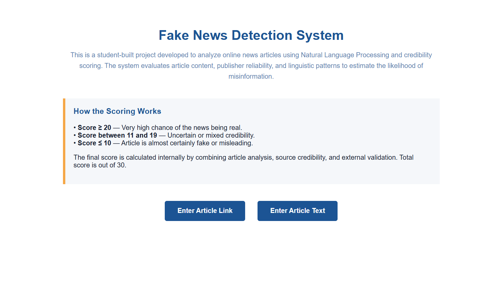
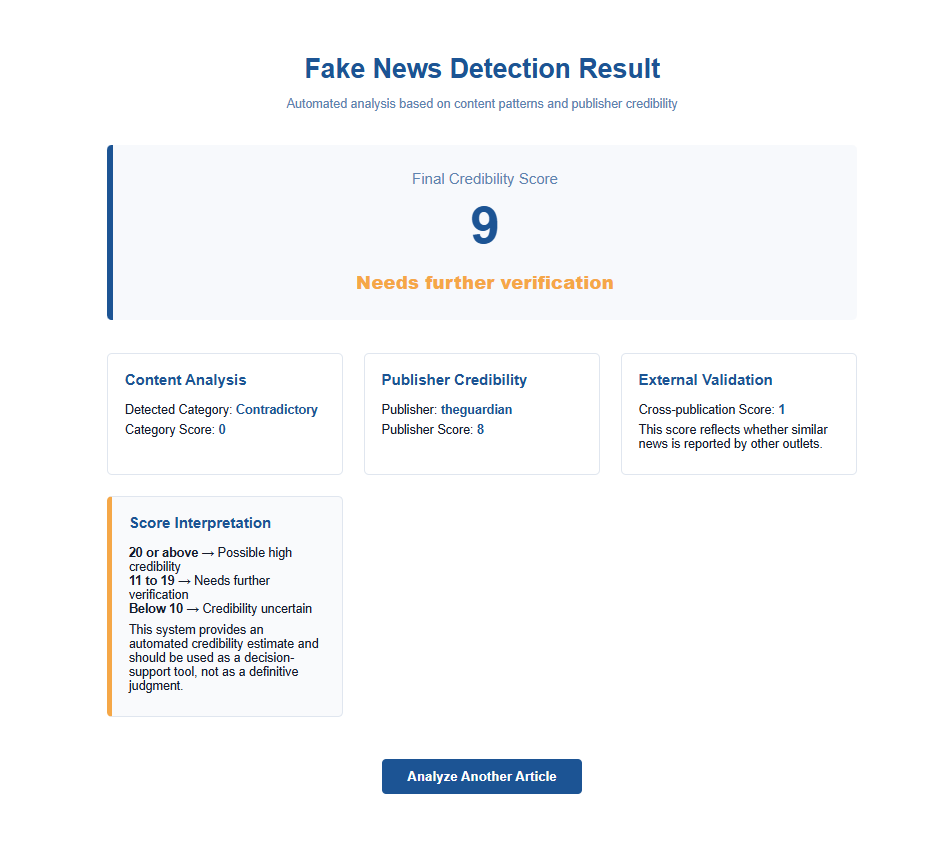

# LIVE DEPLOYMENT NOT POSSIBLE ON RENDER DUE TO BIG MODEL SIZE CAUSING GIT TO CHOKE ON PUSHES. LIVE DOWNLOAD LINK ON itch.io NOT AVAILABLE EITHER DUE TO HUGE SIZE OF MODEL.


# DOWNLOAD THE EXECUTEABLE .exe FILE (THESE ARE OLD VERSIONS WITHOUT THE EXTERNAL VALIDATION MODULES)

FROM DRIVE (https://drive.google.com/drive/folders/1uQYrXVQ6V-DJXEkGeUqBnXd-AaHEbwOa?usp=drive_link).

FROM file.kiwi (https://file.kiwi/d11ef2e1#EaDDD0zIu0L6KLetXWB9lw).

# 📰 Fake News Detection System

An end-to-end **Fake News Detection** web application that evaluates online news articles using **Natural Language Processing**, **source credibility analysis**, and **external content validation** to estimate the likelihood of misinformation.


The system is designed to be **modular**, **explainable**, and **privacy-conscious**, combining machine learning inference with transparent multi-factor scoring and a clean, accessible web interface.


---

## ✨ Key Features

* 🔍 **Content Analysis with BERT**
  Classifies articles into **Neutral**, **Biased**, or **Contradictory** using a fine-tuned transformer-based language model.

* 🏛️ **Publisher Credibility Scoring**
  Evaluates the historical reliability of known publishers using a curated Supabase database.

* 🌐 **External Content Validation**
  Scans the broader web to check whether similar reporting exists across multiple independent sources, strengthening confidence in widely corroborated news.

* 🧮 **Explainable Scoring Framework (Out of 30)**
  Combines content quality, publisher reliability, and external corroboration into a transparent, interpretable score.

* 🌍 **Flexible Input Methods**
  Supports both **article URLs** (auto-scraped) and **raw article text** (direct input).

- 🔐 **Privacy First Architecture**
  No article content or user data is stored. All processing is performed in-memory and discarded after analysis.

---

## 🧠 How the System Works


1. **User Input**
   The user submits either a news article link or raw article text.

2. **Article Extraction**

   * URLs are scraped using **Firecrawl**, with a BeautifulSoup-based fallback.
   * Raw text is passed directly into the analysis pipeline.

3. **BERT-Based Content Classification**
   The article is classified into one of three categories:

   * Neutral
   * Biased
   * Contradictory

4. **Multi-Factor Scoring Logic (0–30)**

   **Category Score (0–10)**

   * Neutral → 10
   * Biased → 5
   * Contradictory → 0

   **Publisher Credibility Score (0–10)**

   * Retrieved from Supabase for known publishers
   * Defaults to 0 if the publisher is unknown

   **External Validation Score (0–10)**

   * Measures whether similar or matching news appears across other reputable sources
   * Higher scores indicate stronger cross-source corroboration

5. **Final Verdict Generation**

   ```text
   Total Score = Category Score + Publisher Score + External Validation Score

   ≥ 20  → Possible high credibility
   7–19  → Needs further verification
   < 7   → Credibility uncertain
   ```

The final verdict is designed to assist decision-making while clearly exposing how each component contributes to the result.

---

## 🖥️ Web Interface

### Home Page



Users can choose whether to submit an **article link** or **article text**.

### Submit Article Link


* Automatically extracts article content
* Accepts optional publisher input

### Submit Article Text


* Allows direct text submission
* Accepts optional publisher input

---

## 📊 Example Output

### Credibility Result Page



The result view presents:

* Final credibility score (out of 30)
* Verdict interpretation
* Content category classification
* Publisher credibility score
* Contribution of external validation

---

## 🤖 Model Training

The project includes a complete **BERT fine-tuning pipeline** using HuggingFace Transformers.

* Model: `bert-base-uncased`
* Labels: Neutral, Biased, Contradictory
* Frameworks: PyTorch, HuggingFace Trainer

### Training Progress


### Evaluation Results


The model demonstrates strong contextual understanding and high accuracy on the held-out test set.

---

## 🗂️ Project Structure

```text
fake_news_detector/
│
├── app.py                  # Flask app entry point
├── config.py               # Environment & configuration loading
├── requirements.txt
│
├── scraping/               # Article extraction logic
│   ├── article_reader.py
│   └── scraper.py
│
├── model/                  # NLP models
│   ├── bert_classifier.py
│   └── train_bert.py
│
├── scoring/                # Scoring & verdict logic
│   ├── category_score.py
│   ├── publisher_score.py
│   └── verdict.py
│
├── database/               # Supabase integration
│   ├── supabase_client.py
│   └── schema.sql
│
├── utils/                  # Helper utilities
│   ├── text_cleaner.py
│   └── publisher_normalizer.py
|   ├── external_validation.py
│
├── data/                   # Training datasets
│   ├── train.csv
│   ├── val.csv
│   └── test.csv
│
├── templates/              # HTML UI templates
│   ├── index.html
│   ├── article_link.html
│   └── article_text.html
│
└── .env
```

---

## ⚙️ Tech Stack

* **Backend**: Python 3.10, Flask
* **NLP / ML**: BERT, HuggingFace Transformers, PyTorch
* **External Validation**: Web search & similarity matching
* **Scraping**: Firecrawl, Requests, BeautifulSoup
* **Database**: Supabase (PostgreSQL)
* **Frontend**: HTML, CSS (Flask templates)

---

## 🚀 Running the Project

```bash
pip install -r requirements.txt
python app.py
```

Ensure your `.env` file contains:

```env
FIRECRAWL_API_KEY=your_key
SUPABASE_URL=your_url
SUPABASE_KEY=your_key
```

---

## ⚠️ Disclaimer

This system provides an **automated credibility assessment** intended as a **decision-support tool**. It does not replace professional fact-checking or journalistic verification.

---

## 👨‍💻 Author

Built as part of an AI/ML-focused project exploring **misinformation detection**, **multi-source validation**, **explainable scoring**, and **responsible NLP deployment**.

If you find this project useful, consider ⭐ starring the repository and experimenting with further enhancements.
