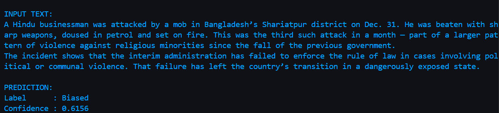
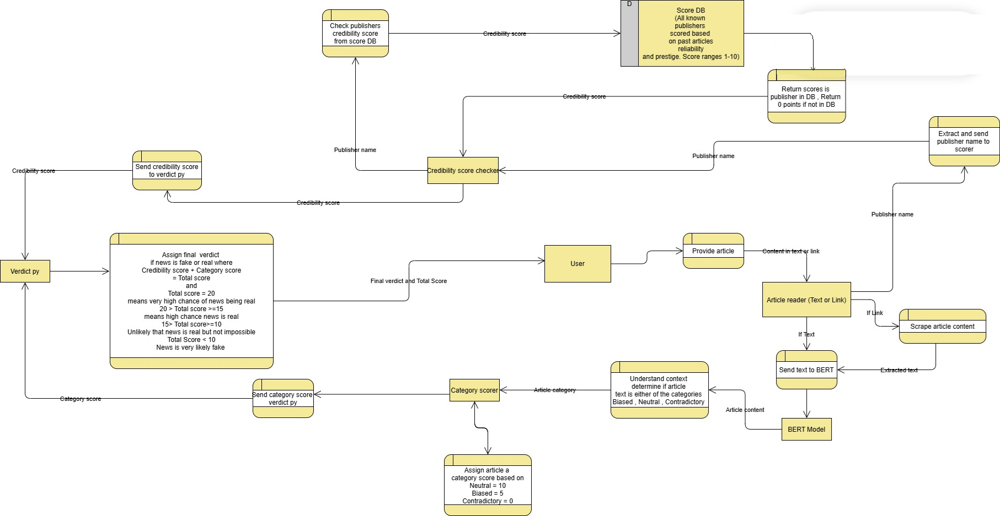
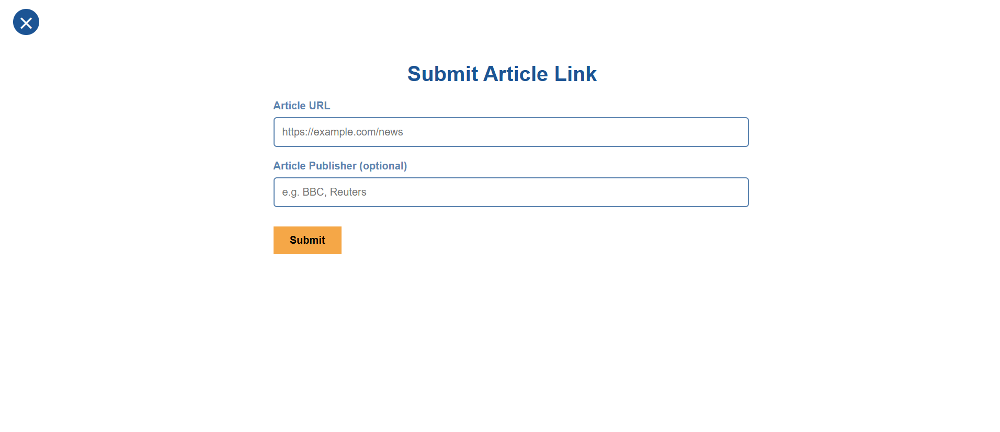
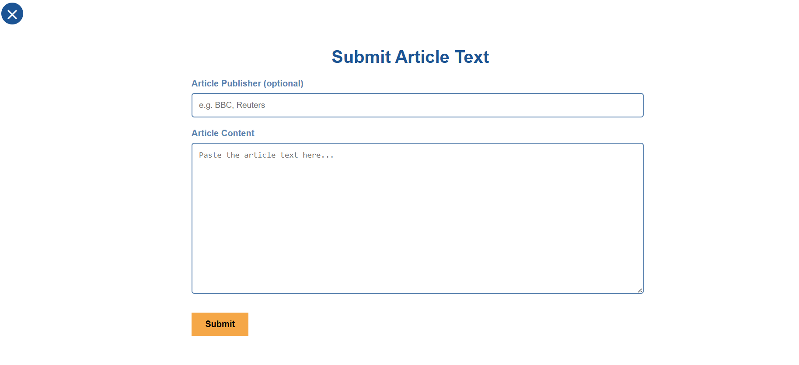

# LIVE DEPLOYMENT NOT POSSIBLE ON RENDER DUE TO BIG MODEL SIZE CAUSING GIT TO CHOKE ON PUSHES. LIVE DOWNLOAD LINK ON itch.io NOT AVAILABLE EITHER DUE TO HUGE SIZE OF MODEL.


DOWNLOAD THE EXECUTEABLE .exe FILE FROM DRIVE (https://drive.google.com/drive/folders/1uQYrXVQ6V-DJXEkGeUqBnXd-AaHEbwOa?usp=drive_link).
FROM file.kiwi (https://file.kiwi/d11ef2e1#EaDDD0zIu0L6KLetXWB9lw)

# 📰 Fake News Detection System

An end-to-end **Fake News Detection** web application that analyzes online news articles using **Natural Language Processing**, **BERT-based content classification**, and **publisher credibility scoring** to estimate the likelihood of misinformation.

Built as a modular, explainable, and privacy-conscious system, this project combines ML inference with transparent scoring logic and a clean web UI.


---

## ✨ Key Features

* 🔍 **Content Analysis with BERT**
  Classifies articles into **Neutral**, **Biased**, or **Contradictory** using a fine-tuned transformer model.

* 🏛️ **Publisher Credibility Scoring**
  Looks up known publishers from a curated Supabase database (score range: 0–10).

* 🧮 **Explainable Final Verdict**
  Combines content score + publisher score into a transparent, threshold-based credibility verdict.

* 🌐 **Flexible Input**
  Analyze either:



* 🔐 **Privacy First**
  No article text or user data is stored. All inference happens in-memory.

---

## 🧠 How the System Works



1. **User Input**
   User submits a news article as a link or raw text.

2. **Article Extraction**

   * URLs are scraped using **Firecrawl** (with BeautifulSoup fallback).
   * Raw text is passed directly.

3. **BERT Classification**
   The article is classified into one of three categories:

   * Neutral
   * Biased
   * Contradictory

4. **Scoring Logic**

   **Category Score**

   * Neutral → 10
   * Biased → 5
   * Contradictory → 0

   **Publisher Score**

   * Retrieved from Supabase (0–10)
   * Defaults to 0 if unknown

5. **Final Verdict**

   ```text
   Total Score = Category Score + Publisher Score

   ≥ 15  → Possible high credibility
   7–14  → Needs further verification
   < 7   → Credibility uncertain
   ```

---

## 🖥️ Web Interface

### Home Page


Users can choose whether to submit a **link** or **article text**.

### Submit Article Link



* Automatically extracts article content
* Optional publisher input

### Submit Article Text



* Paste full article content directly
* Optional publisher input

---

## 📊 Example Output

### Credibility Result Page


Displays:

* Final credibility score
* Verdict explanation
* Content category
* Publisher credibility

## 🤖 Model Training

The project includes a full **BERT training pipeline** using HuggingFace Transformers.

* Model: `bert-base-uncased`
* Labels: Neutral, Biased, Contradictory
* Frameworks: PyTorch + HuggingFace Trainer

### Training Progress


### Evaluation Results


Achieves high accuracy on the test set, demonstrating strong contextual understanding.

---

## 🗂️ Project Structure

```text
fake_news_detector/
│
├── app.py                  # Flask app entry point
├── config.py               # Environment & config loading
├── requirements.txt
│
├── scraping/               # Article extraction
│   ├── article_reader.py
│   └── scraper.py
│
├── model/                  # NLP models
│   ├── bert_classifier.py
│   └── train_bert.py
│
├── scoring/                # Scoring logic
│   ├── category_score.py
│   ├── publisher_score.py
│   └── verdict.py
│
├── database/               # Supabase integration
│   ├── supabase_client.py
│   └── schema.sql
│
├── utils/                  # Helpers
│   ├── text_cleaner.py
│   └── publisher_normalizer.py
│
├── data/                   # Training datasets
│   ├── train.csv
│   ├── val.csv
│   └── test.csv
│
├── templates/              # HTML UI
│   ├── index.html
│   ├── article_link.html
│   └── article_text.html
│
└── .env
```

---

## ⚙️ Tech Stack

* **Backend**: Python 3.10, Flask
* **NLP / ML**: BERT, HuggingFace Transformers, PyTorch
* **Scraping**: Firecrawl, Requests, BeautifulSoup
* **Database**: Supabase (PostgreSQL)
* **Frontend**: HTML, CSS (Flask templates)

---

## 🚀 Running the Project

```bash
pip install -r requirements.txt
python app.py
```

Make sure your `.env` file contains:

```env
FIRECRAWL_API_KEY=your_key
SUPABASE_URL=your_url
SUPABASE_KEY=your_key
```

---

## ⚠️ Disclaimer

This system provides an **automated credibility estimate** and is intended as a **decision-support tool**, not a definitive judgment of truth.

---

## 👨‍💻 Author

Built as part of an AI/ML-focused project exploring **misinformation detection**, **explainable scoring**, and **responsible NLP deployment**.

If this helped you, feel free to ⭐ the repository and experiment further.

